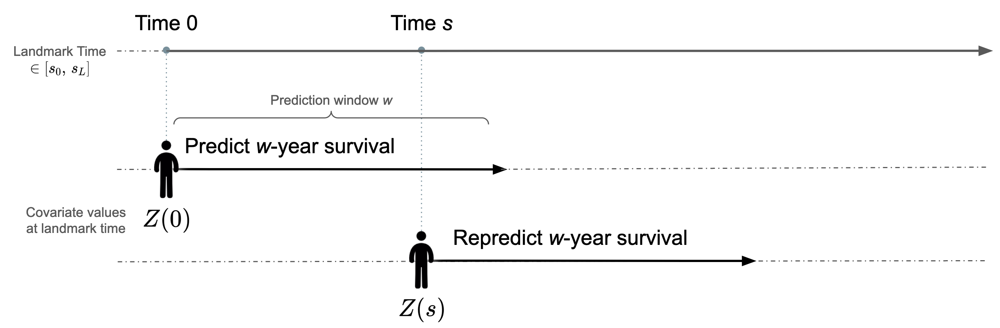

<!-- README.md is generated from README.Rmd. Please edit that file -->

```{r, include = FALSE}
knitr::opts_chunk$set(
  collapse = TRUE,
  comment = "#>",
  fig.path = "man/figures/README-",
  out.width = "100%"
)
```

# dynamicLM

<!-- badges: start -->
<!-- badges: end -->

The goal of dynamicLM is to provide a simple framework to make dynamic w-year risk predictions, allowing for competing risks, time-dependent covariates, and censored data.

# What is landmarking and when is it used?

“Dynamic prediction” involves obtaining prediction probabilities at baseline and later points in time; it is essential for better-individualized treatment. Personalized risk is updated with new information and/or as time passes.



An example is cancer treatment: we may want to predict a 5-year risk of
recurrence whenever a patient’s health information changes. For example,
we can predict *w*-year risk of recurrence at baseline (time = 0) given
their initial covariates *Z*(0) (e.g.,30 years old, on treatment), and
we can then predict *w*-year risk at a later point *s* given their
current covariates *Z*(*s*) (e.g., 30+*s* years old, off treatment).
Note that here the predictions make use of the most recent covariate
value of the patient.

The landmark model for survival data is a simple and powerful approach
to dynamic prediction for many reasons:

-   **Time-varying effects** are captured by considering interaction
    terms between the prediction (“landmark”) time and covariates
-   **Time-dependent covariates** can be used, in which case, for
    prediction at landmark time *s*, the most updated value *Z*(*s*)
    will be used. Note that covariates do not have to be time-dependent
    because time-varying effects will be captured regardless.
-   **Competing risks** analysis can be performed. Here, we consider the
    time-to-first-event (‘time’) and the event type (‘cause’).

Putter and Houwelingen describe landmarking extensively
[here](https://onlinelibrary.wiley.com/doi/10.1111/j.1467-9469.2006.00529.x)
and [here](https://onlinelibrary.wiley.com/doi/full/10.1002/sim.5665).

The creation of the landmark model for survival data is built on the
concept of risk assessment times (i.e., landmarks) that span risk
prediction times of interest. In this approach, a training dataset of
the study cohort is transformed into multiple censored datasets based on
a prediction window of interest and the predefined landmarks. A model is
fit on these stacked datasets (i.e., supermodel), and dynamic risk
prediction is then performed by using the most up-to-date value of a
patient’s covariate values.

## Installation

You can install the development version of `dynamicLM` from
[GitHub](https://github.com/) with:

```{r}
# install.packages("devtools")
devtools::install_github("thehanlab/dynamicLM", ref = "proposed-updates")
```

Requirements for the package can be found in the description file.

# Basic Example

This is a basic example which shows you how to use `dynamicLM` to make
dynamic 5-year predictions and check calibration and discrimination
metrics.

## Data

Data can come in various forms, with or without time-dependent
covariates:

-   Static data, with one entry per patient. Here, landmark time-varying
    effects are still considered for dynamic risk prediction.
-   Longitudinal (long-form) data, with multiple entries for each
    patient with updated covariate information.
-   Wide-form data, with a column containing the time at which the
    covariate changes from 0 to 1.

We illustrate the package using the long-form example data set given in
the package. This gives the time-to-event of cancer relapse under two
competing risks. Three fixed patient bio-markers are given as well (age at
baseline, stage of initial cancer, bmi, male). A time-dependent
covariate treatment indicates if the treatment is on or off treatment
and `T_txgiven` gives the time at which this patient entry was created.

```{r}
library(dynamicLM)
```

```{r}
data(relapse)
dim(relapse)
```

```{r}
length(unique(relapse$ID)) # There are 171 patients with two entries, i.e., one after time 0
```

## Build a super data set

We first note the outcome variables we are interested in, as well as
which variables are fixed or landmark-varying. When there are no
landmark-varying variables, set `varying = NULL`.

```{r}
outcome <- list(time = "Time", status = "event")
covars <- list(fixed = c("age.at.time.0","male","stage","bmi"),
               varying = c("treatment"))
```

We will produce 5-year dynamic predictions of relapse (`w`). Landmark
time points (`lms`) are set as every year between 0 and 3 years to train
the model. This means we are only interested in prediction between 0 and
3 years.

We will consider linear and quadratic landmark interactions with the
covariates (given in `func_covars`) and the landmarks (`func_lms`). The
covariates that should have these landmark interactions are given in
`pred_covars`.


```{r}
w <- 60                    # risk prediction window (risk within time w)
lms <- seq(0,36,by=6)      # landmarks on which to build the model

# Covariate-landmark time interactions
func_covars <- list(function(t) t, function(t) t^2)
# let hazard depend on landmark time
func_lms <- list(function(t) t, function(t) t^2)
# Choose variables that will have time interaction
pred_covars <- c("age", "male", "stage", "bmi", "treatment") 
```

With this, we are ready to build the super data set that will train the
model. We print intermediate steps for illustration.

There are three steps:

1.  `stack_data()`: stacks the landmark data sets
2.  An **optional** additional update for more complex columns that vary
    with landmark-times: For example, here we update the value of age.
3.  `add_interactions()`: Landmark time interactions are added, note the
    additional columns created.

*Note that these return an object of class `LMdataframe`. This has a
component `data` which contains the dataset itself.* 

We illustrate the process in detail by printing the entries at each step 
for one individual, ID1029.

```{r}
relapse[relapse$ID == "ID1029",]  
```

We first stack the datasets over the landmarks (see the new column ‘LM’)
and update the treatment covariate. Note that one row is created for
each landmark that the individual is still alive at. In this row, if
time is greater time than the landmark time plus the window, it is
censored at this value (this occurs in the first row, for example,
censored at 0+60), and the most recent value all covariates is used (in
our case, only treatment varies).

```{r}
# Stack landmark datasets
lmdata <- stack_data(relapse, outcome, lms, w, covars, format = "long",
                     id = "ID", rtime = "T_txgiven")
data <- lmdata$data
print(data[data$ID == "ID1029",])
```

We then (optionally) update more complex LM-varying covariates. Here we
create an age covariate, based on age at time 0.

```{r}
lmdata$data$age <- lmdata$data$age.at.time.0 + lmdata$data$LM/12 # age is in years and LM is in months
data <- lmdata$data
print(data[data$ID == "ID1029",])
```

Lastly, we add landmark time-interactions. The `_1` refers to the first
interaction in `func_covars`, `_2` refers to the second interaction in
`func_covars`, etc… Similarly, `LM_1` and `LM_2` are created from
`func_lm`. Note that we use `pred_covars` here, defined earlier as the 
covariates that will have landmark time interactions.

```{r}
lmdata <- add_interactions(lmdata, pred_covars, func_covars, func_lms) 
data <- lmdata$data
print(data[data$ID == "ID1029",])
```

One can print `lmdata`. The argument `verbose` allows for additional stored 
objects to be printed (default is FALSE).

```{r, eval = FALSE}
print(lmdata, verbose = TRUE)
```


## Fit the super model

Now we can fit the model. We fit a model with all the covariates
created. Note that `lmdata$all_covs` returns a vector with all the
covariates that have LM interactions and from `pred_covars`. Again, the
`_1` refers to the first interaction in `func_covars`, `_2` refers to
the second interaction in `func.covars`, etc… `LM_1` and `LM_2` are
created from `func_lms`.

```{r}
all_covs <- lmdata$all_covs
print(all_covs)
```

It is then easy to fit a landmark supermodel using `dynamic_lm()`. A formula,
super dataset and method need to be provided. If the super dataset is
not of class `LMdataframe` (i.e., is a self-created R dataframe), then
additional parameters must be specified. In this case, see the details
section of the documentation of `add_interactions()` for information on how
the landmark interaction terms must be named.

```{r}
formula <- "Hist(Time, event, LM) ~ age + male + stage + bmi + treatment + age_1 + age_2 + male_1 + male_2 + stage_1 + stage_2 + bmi_1 + bmi_2 + treatment_1 + treatment_2 + LM_1 + LM_2 + cluster(ID)"
supermodel <- dynamic_lm(as.formula(formula), lmdata, "CSC") 
print(supermodel)
```

There are additional ways of printing/accessing the model:

```{r, eval = FALSE}
# E.g., of additional arguments to print
# * cause: only print this cause-specific model
# * verbose: show additional stored objects
print(supermodel, cause = 1, verbose = TRUE)

# Coefficients can easily be accessed via
coef(supermodel)
```


Dynamic hazard ratios can be plotted, either log hazard ratio or hazard
ratio using the argument `logHR`. Specifying the `covars` arguments allows for a subset of dynamic hazard ratios to be plotted.

```{r dynhr}
par(mfrow = c(2,3))
plot(supermodel)
```

```{r, eval=F}
# To create only two plots:
plot(supermodel, covars = c("age", "male"))
```

## Obtain predictions

### For the training data

Predictions for the training data can easily be obtained. This provides
*w*-year risk estimates for each individual at each of the training
landmarks they are still alive.

```{r}
p1 <- predict(supermodel)
print(p1)
```

One can print the predictions. The argument `verbose` allows for additional 
stored objects to be printed (default is FALSE).

```{r, eval = FALSE}
print(p1, verbose = TRUE)
```

### For new data

A prediction is made for an individual at a specific prediction time.
Thus both a prediction (“landmark”) time (e.g., at baseline, at 2 years,
etc) and an individual (i.e., covariate values set at the landmark
time-point) must be given. Note that the model creates the landmark
time-interactions; the new data has the same form as in your original
dataset. For example, we can prediction *w*-year risk from baseline
using an entry from the very original data frame.

```{r}
# Individuals with covariate values at 0
individuals <- relapse[1:2, ]
individuals$age <- individuals$age.at.time.0
individuals$LM <- 0 # Prediction time
print(individuals)
```

```{r}
p0 <- predict(supermodel, individuals, lms = "LM", cause = 1)
p0$preds
```

## Model evaluation/validation

Calibration plots, which assess the agreement between predictions and
observations in different percentiles of the predicted values, can be
plotted for each of the landmarks used for prediction. Entering a named
list of prediction objects in the first argument allows for comparison between 
models. This list can be of supermodels or prediction objects (created by 
calling `predict()`).

```{r calplot}
par(mfrow = c(2, 3), pty = "s")
outlist <- calplot(list("LM supermodel" = p1), 
                    times = c(0,6,12,18,24,30), # landmarks to plot at
                    method = "quantile", q=10,  # method for calibration plot
                    # Optional plotting parameters to alter
                    ylim = c(0, 0.36), xlim = c(0, 0.36), 
                    lwd = 1, xlab = "Predicted Risk", ylab = "Observed Risk", legend = F)
```

Predictive performance can also be assessed using time-dependent dynamic
area under the receiving operator curve (AUCt) or time-dependent dynamic
Brier score (BSt).

-   AUCt is defined as the percentage of correctly ordered markers when
    comparing a case and a control – i.e., those who incur the pr
    imary
    event within the window w after prediction and those who do not.
-   BSt provides the average squared difference between the primary
    event markers at time w after prediction and the absolute risk
    estimates by that time point.
    
```{r}
scores <- score(list("LM supermodel" = p1),
                     times = c(6, 12, 18, 24)) # landmarks at which to assess
scores
```

These results can also be plot with point wise confidence intervals. Setting
`se = FALSE` in plot excludes the intervals.

```{r, fig.height = 4, fig.width = 9}
par(mfrow = c(1, 2))
plot(scores)
```


**Bootstrapping** can be performed by calling `calplot()` or `score()` and setting 
the arguments `split.method = "bootcv"` and `B = 10` (or however many bootstrap 
replications are desired). Note that the argument `x = TRUE` must be specified 
when fitting the model (i.e., when calling `dynamic_lm()`).

```{r, eval = FALSE}
# Remember to fit the supermodel with argument 'x = TRUE'
scores <- score(list("LM supermodel" = supermodel),
              times = c(0, 6),
              split.method = "bootcv", B = 10)       # 10 bootstraps

par(mfrow = c(1, 2))
outlist <- calplot(list("LM supermodel" = supermodel), 
                    times = c(0, 6),                 # landmarks to plot at
                    method = "quantile", q = 10,     # calibration plot method
                    split.method = "bootcv", B = 10, # 10 bootstraps
                    # Optional plotting parameters to alter
                    ylim = c(0, 0.36), xlim = c(0, 0.36), 
                    lwd = 1, xlab = "Predicted Risk", ylab = "Observed Risk", 
                    legend = FALSE)
```


**External validation** can be performed by specifying the supermodel as the 
object argument and passing new data through the `data` argument. This data can 
be a LMdataframe or a dataframe (in which case `lms` must be specified). 
Alternatively, predictions can be made on new data using `predict()` and this 
object can be input.

```{r, eval = FALSE}
# Use all data from baseline as "new" data
newdata <- relapse[relapse$T_txgiven == 0, ]
newdata$age <- newdata$age.at.time.0
newdata$LM <- 0 # specify the landmark time of the data points

par(mfrow = c(1,1))
cal <- calplot(list("CSC" = supermodel), cause = 1, data = newdata, lms = "LM",
               method = "quantile", q = 10, ylim = c(0, 0.1), xlim = c(0, 0.1))

score(list("CSC" = supermodel), cause = 1, data = newdata, lms = "LM")
```


### Visualize individual dynamic risk trajectories

Individual risk score trajectories can be plotted. As with `predict()`,
the data input is in the form of the original data. For example, we can
consider two individuals of similar age, bmi, and treatment status at
baseline, but of different gender.

```{r}
idx <- relapse$ID %in% c("ID2412", "ID1007")
relapse[idx, ]
```

We turn our data into long-form data to plot.

*Note: we convert to long-form because of the age variable, wide-form
data can be used too if there are no complex variables involved.*

```{r}
# Prediction time points 
x <- seq(0, 36, by = 6)

# Stack landmark datasets
dat <- stack_data(relapse[idx, ], outcome, x, w, covars, format = "long", 
                  id = "ID", rtime = "T_txgiven")$data
dat$age <- dat$age.at.time.0 + dat$LM / 12 # age is in years and LM is in months

head(dat)
```

```{r plotrisk}
plotrisk(supermodel, dat, format = "long", ylim = c(0, 0.7), x.legend = "topright")
```

We can see that the male has a higher and increasing 5-year risk of
recurrence that peaks around 1 year, and then rapidly decreases. This
can be explained by the dynamic hazard rate of being male (seen above). In
comparison, the 5-year risk of recurrent for the female remains
relatively constant.


