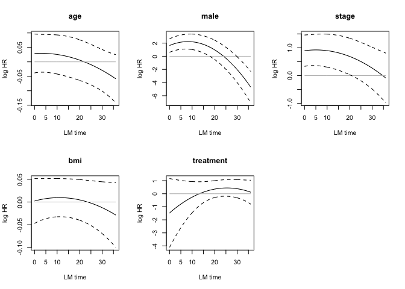
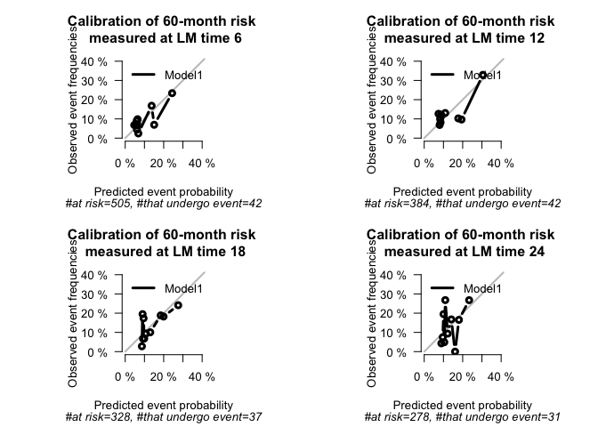
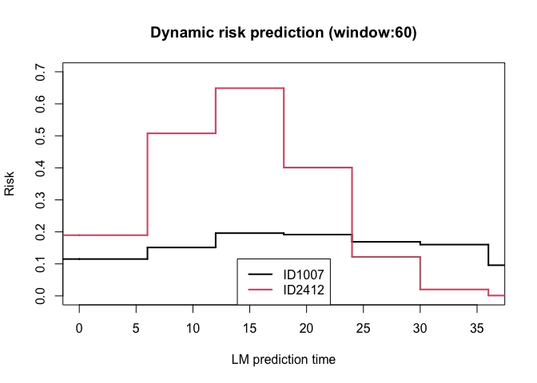

<!-- README.md is generated from README.Rmd. Please edit that file -->

# dynLM

<!-- badges: start -->
<!-- badges: end -->

The goal of dynLM is to provide a simple framework to make dynamic
w-year risk predictions from landmark time points, allowing for
competing risks and left and right censored data.

## Installation

You can install the development version of dynLM from
[GitHub](https://github.com/) with:

    ```R 
    # install.packages("devtools")
    devtools::install_github("anyafries/dynLM") 
    ```

## Example

This is a basic example which shows you how to use dynLM to make dynamic
predictions and check calibration and discrimination metrics. First, we
use the wide-form example data set given in the package. This gives the
time-to-event of cancer relapse under 2 competing risks. 3 fixed patient
bio-markers are given as well as the variable treatment which indicates
the time at which the patient went off treatment.

    library(dynLM)
    #> Loading required package: prodlim
    #> Loading required package: survival

    data(relapse)
    head(relapse)
    #>          Time event  ID      age marker1 marker2 marker3   treatment
    #> 1  0.08493151     2 ID1 89.39726       0       0       1  0.08493151
    #> 2  1.50684932     2 ID2 76.80000       0       1       1  1.50684932
    #> 3 10.34246575     0 ID3 80.21644       0       0       0 10.34246575
    #> 4  1.33150685     3 ID4 68.29863       0       0       0  1.33150685
    #> 5  2.74794521     2 ID5 52.45205       1       0       1  2.74794521
    #> 6  3.16438356     2 ID6 74.30411       0       0       0  3.16438356

*Note: data can also be input in long-form. The only change is that
later, the format argument to cutLMsuper will be given as “long”.*

### Build a super data set

We first note the outcome variables we are interested in, as well as
which variables are fixed or landmark-varying. In case there are no
landmark-varying variables, set `varying=NULL`.

    outcome = list(time="Time", status="event")
    covs = list(fixed=c("ID","age","marker1","marker2","marker3"),
                varying=c("treatment"))

We will produce 5-year dynamic predictions of relapse (`w`). Landmark
time points (`LMs`) are set as every year between 0 and 3 years to train
the model.

We will consider constant and linear landmark interactions with the
covariates (given in `func_covars`) and linear effects from the
landmarks (`func_LMs`). The covariates that should have these landmark
interactions are given in `LMcovars`.

    w <- 5
    LMs <- seq(0,3,by=1)

    func_covars <- list(
      function(t) 1,
      function(t) t
      )
    func_LMs <- list(
      function(t) t
    )

    LMcovars <- c("age","marker1","marker2","marker3","treatment")

With this, we are ready to build the super data set that will train the
model. We print intermediate steps for illustration. There are three
steps:

1.  `cutLMsuper`: stacks the landmark data sets
2.  An **optional** additional update for more complex columns that vary
    with landmark-times: For example, here we update the value of age.
3.  `addLMtime`: Landmark time interactions are added

*Note that these return an object of class `LMdataframe`. This has an
item `LMdata` which contains the dataset itself.*

    # Stack landmark datasets
    LMdata <- cutLMsuper(relapse, outcome, LMs, w, covs, format="wide")
    head(LMdata$LMdata)
    #>         Time event  ID      age marker1 marker2 marker3 treatment LM
    #> 1 0.08493151     2 ID1 89.39726       0       0       1         0  0
    #> 2 1.50684932     2 ID2 76.80000       0       1       1         0  0
    #> 3 5.00000000     0 ID3 80.21644       0       0       0         0  0
    #> 4 1.33150685     3 ID4 68.29863       0       0       0         0  0
    #> 5 2.74794521     2 ID5 52.45205       1       0       1         0  0
    #> 6 3.16438356     2 ID6 74.30411       0       0       0         0  0

    # Update complex LM-varying covariates 
    LMdata$LMdata$age <- LMdata$LMdata$age + LMdata$LMdata$LM
    head(LMdata$LMdata)
    #>         Time event  ID      age marker1 marker2 marker3 treatment LM
    #> 1 0.08493151     2 ID1 89.39726       0       0       1         0  0
    #> 2 1.50684932     2 ID2 76.80000       0       1       1         0  0
    #> 3 5.00000000     0 ID3 80.21644       0       0       0         0  0
    #> 4 1.33150685     3 ID4 68.29863       0       0       0         0  0
    #> 5 2.74794521     2 ID5 52.45205       1       0       1         0  0
    #> 6 3.16438356     2 ID6 74.30411       0       0       0         0  0

    # Add LM-time interactions
    LMdata <- addLMtime(LMdata, LMcovars, func_covars, func_LMs)
    head(LMdata$LMdata)
    #>         Time event  ID LM    age_1 age_2 marker1_1 marker1_2 marker2_1
    #> 1 0.08493151     2 ID1  0 89.39726     0         0         0         0
    #> 2 1.50684932     2 ID2  0 76.80000     0         0         0         1
    #> 3 5.00000000     0 ID3  0 80.21644     0         0         0         0
    #> 4 1.33150685     3 ID4  0 68.29863     0         0         0         0
    #> 5 2.74794521     2 ID5  0 52.45205     0         1         0         0
    #> 6 3.16438356     2 ID6  0 74.30411     0         0         0         0
    #>   marker2_2 marker3_1 marker3_2 treatment_1 treatment_2 LM_1
    #> 1         0         1         0           0           0    0
    #> 2         0         1         0           0           0    0
    #> 3         0         0         0           0           0    0
    #> 4         0         0         0           0           0    0
    #> 5         0         1         0           0           0    0
    #> 6         0         0         0           0           0    0

### Fit the super model

Now we can fit the model. We fit a model with all the covariates
created. Note that `LMdata$allLMcovars` gives all the covariates with LM
interaction

    model_covars <- LMdata$allLMcovars
    print(model_covars)
    #>  [1] "age_1"       "age_2"       "marker1_1"   "marker1_2"   "marker2_1"  
    #>  [6] "marker2_2"   "marker3_1"   "marker3_2"   "treatment_1" "treatment_2"
    #> [11] "LM_1"

    formula <- paste("Hist(Time, event, LM)", "~", 
                     paste(model_covars, collapse=" + "), "+ cluster(ID)")
    supermodel <- fitLM(as.formula(formula), LMdata, "CSC") 
    #> Warning in .recacheSubclasses(def@className, def, env): undefined subclass
    #> "numericVector" of class "Mnumeric"; definition not updated
    # supermodel

Dynamic hazard ratios can be plotted:

    par(mfrow=c(2,3))
    plot_dynamic_HR(supermodel)



### Obtain predictions

#### For new data

A prediction is made for an individual at a specific prediction time
(e.g., at baseline, at 2 years, etc). Thus both an individual and a
prediction (landmark) time must be given.

New data is given as a dataframe with individual covariates associated
with a landmark time point (i.e., covariate values set at the landmark
time-point). E.g., this can be an entry from the very original data
frame.

    ind = relapse[1:3,]
    tLM = c(0,0,0)
    p0 = predLMrisk(supermodel, ind, tLM, cause=1)
    p0$preds
    #>   LM         risk
    #> 1  0 2.524393e-03
    #> 2  0 5.203076e-02
    #> 3  0 1.836886e-27

#### For the training data

Predictions for the training data can be obtained:

    p1 = predLMrisk(supermodel)

We can observe calibration. Entering a named list of prediction objects
from `predLMrisk` in the first argument allows for comparison between
models.

    method="quantile"
    q=10
    YLIM=XLIM=c(0,0.2)

    par(mfrow=c(2,2),pty="s")
    outlist = LMcalPlot(list("sm"=p1), cause=1, method=method, q=q, ylim=YLIM, xlim=XLIM) 



Obtain the time-dependent Brier score and AUC for w-year prediction from
landmarks:

    scores = LMScore(list("LM"=p1), cause=1)
    scores
    #> 
    #> Metric: Time-dependent AUC for 5-year risk prediction
    #> 
    #> Results by model:
    #>    tLM model    AUC  lower  upper
    #> 1:   0    LM 81.844 77.289 86.398
    #> 2:   1    LM 66.026 60.543 71.509
    #> 3:   2    LM 64.233 59.573 68.894
    #> 4:   3    LM 61.052 56.441 65.663
    #> NOTE: Values are multiplied by 100 and given in %.
    #> NOTE: The higher AUC the better.
    #> NOTE: Predictions are made at time tLM for 5-year risk
    #> 
    #> Metric: Brier Score for 5-year risk prediction
    #> 
    #> Results by model:
    #>    tLM      model Brier lower upper
    #> 1:   0 Null model 1.718 1.307 2.130
    #> 2:   0         LM 1.664 1.270 2.059
    #> 3:   1 Null model 3.064 2.255 3.873
    #> 4:   1         LM 2.976 2.197 3.755
    #> 5:   2 Null model 4.558 3.373 5.743
    #> 6:   2         LM 4.420 3.272 5.567
    #> 7:   3 Null model 4.737 3.360 6.115
    #> 8:   3         LM 4.631 3.288 5.974
    #> NOTE: Values are multiplied by 100 and given in %.
    #> NOTE: The lower Brier the better.
    #> NOTE: Predictions are made at time tLM for 5-year risk

### Visualize individual dynamic risk trajectories

Individual risk score trajectories can be plotted. As with `predLMrisk`,
the data input is in the form of the original data. For example:

    idx <- c(1,15,294)
    relapse[idx,]
    #>           Time event    ID      age marker1 marker2 marker3  treatment
    #> 1   0.08493151     2   ID1 89.39726       0       0       1 0.08493151
    #> 15  3.33424658     2  ID15 56.45753       0       0       1 3.33424658
    #> 294 8.33972603     0 ID294 79.38356       0       0       0 0.62000000

We turn our data into long-form data to plot.

*Note: we convert to long-form because of the age variable, wide-form
data can be used too if there are no complex variables involved.*

    # Prediction time points
    x = seq(0,3,by=0.05)

    # Create long-form data to plot individual trajetory
    dat = cutLMsuper(relapse[idx,],outcome, x, w, covs, format="wide")$LMdata
    dat$age = dat$age+dat$LM

    head(dat)
    #>            Time event    ID      age marker1 marker2 marker3 treatment   LM
    #> 1    0.08493151     2   ID1 89.39726       0       0       1         0 0.00
    #> 15   3.33424658     2  ID15 56.45753       0       0       1         0 0.00
    #> 294  5.00000000     0 ID294 79.38356       0       0       0         0 0.00
    #> 11   0.08493151     2   ID1 89.44726       0       0       1         0 0.05
    #> 151  3.33424658     2  ID15 56.50753       0       0       1         0 0.05
    #> 2941 5.05000000     0 ID294 79.43356       0       0       0         0 0.05

    plotRisk(supermodel, dat,
                format="long", LM_col = "LM", id_col="ID", cause=1, ylim=c(0, 0.2))


