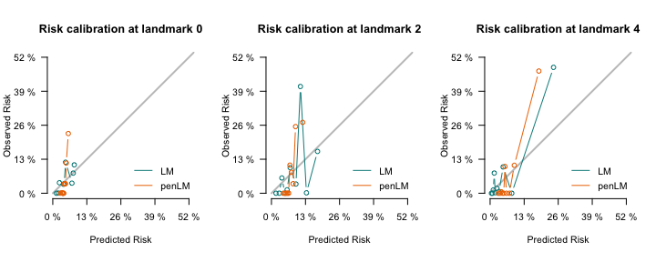

- <a href="#dynamiclm" id="toc-dynamiclm">1 dynamicLM</a>
- <a href="#what-is-landmarking-and-when-is-it-used"
  id="toc-what-is-landmarking-and-when-is-it-used">2 What is landmarking
  and when is it used?</a>
  - <a href="#installation" id="toc-installation">2.1 Installation</a>
- <a href="#basic-example" id="toc-basic-example">3 Basic Example</a>
  - <a href="#data" id="toc-data">3.1 Data</a>
  - <a href="#build-a-super-data-set" id="toc-build-a-super-data-set">3.2
    Build a super data set</a>
  - <a href="#fit-the-super-model" id="toc-fit-the-super-model">3.3 Fit the
    super model</a>
  - <a href="#obtain-predictions" id="toc-obtain-predictions">3.4 Obtain
    predictions</a>
  - <a href="#model-evaluation" id="toc-model-evaluation">3.5 Model
    evaluation</a>

<!-- README.md is generated from README.Rmd. Please edit that file -->

# 1 dynamicLM

<!-- badges: start -->
<!-- badges: end -->

The goal of dynamicLM is to provide a simple framework to make dynamic
w-year risk predictions, allowing for competing risks, time-dependent
covariates, and censored data.

# 2 What is landmarking and when is it used?

“Dynamic prediction” involves obtaining prediction probabilities at
baseline and later points in time; it is essential for
better-individualized treatment. Personalized risk is updated with new
information and/or as time passes.


An example is cancer treatment: we may want to predict a 5-year risk of
recurrence whenever a patient’s health information changes. For example,
we can predict *w*-year risk of recurrence at baseline (time = 0) given
their initial covariates *Z*(0) (e.g.,30 years old, on treatment), and
we can then predict *w*-year risk at a later point *s* given their
current covariates *Z*(*s*) (e.g., 30+*s* years old, off treatment).
Note that here the predictions make use of the most recent covariate
value of the patient.

The landmark model for survival data is a simple and powerful approach
to dynamic prediction for many reasons:

- **Time-varying effects** are captured by considering interaction terms
  between the prediction (“landmark”) time and covariates
- **Time-dependent covariates** can be used, in which case, for
  prediction at landmark time *s*, the most updated value *Z*(*s*) will
  be used. Note that covariates do not have to be time-dependent because
  time-varying effects will be captured regardless.
- **Competing risks** analysis can be performed. Here, we consider the
  time-to-first-event (‘time’) and the event type (‘cause’).

Putter and Houwelingen describe landmarking extensively
[here](https://onlinelibrary.wiley.com/doi/10.1111/j.1467-9469.2006.00529.x)
and [here](https://onlinelibrary.wiley.com/doi/full/10.1002/sim.5665).

The creation of the landmark model for survival data is built on the
concept of risk assessment times (i.e., landmarks) that span risk
prediction times of interest. In this approach, a training dataset of
the study cohort is transformed into multiple censored datasets based on
a prediction window of interest and the predefined landmarks. A model is
fit on these stacked datasets (i.e., supermodel), and dynamic risk
prediction is then performed by using the most up-to-date value of a
patient’s covariate values.

## 2.1 Installation

You can install the development version of `dynamicLM` from
[GitHub](https://github.com/) with:

``` r
# install.packages("devtools")
devtools::install_github("thehanlab/dynamicLM", ref = "proposed-updates")
#> Downloading GitHub repo thehanlab/dynamicLM@proposed-updates
#> 
#>      checking for file ‘/private/var/folders/r0/ckqbvqg52r53ct7wxr5yz50h0000gn/T/RtmpYUUYfY/remotesb078090fe1/thehanlab-dynamicLM-9ac58a7/DESCRIPTION’ ...  ✔  checking for file ‘/private/var/folders/r0/ckqbvqg52r53ct7wxr5yz50h0000gn/T/RtmpYUUYfY/remotesb078090fe1/thehanlab-dynamicLM-9ac58a7/DESCRIPTION’
#>   ─  preparing ‘dynamicLM’:
#>      checking DESCRIPTION meta-information ...  ✔  checking DESCRIPTION meta-information
#>   ─  checking for LF line-endings in source and make files and shell scripts
#>   ─  checking for empty or unneeded directories
#>   ─  building ‘dynamicLM_0.3.0.tar.gz’
#>      
#> 
```

Requirements for the package can be found in the description file.

# 3 Basic Example

This is a basic example which shows you how to use `dynamicLM` to make
dynamic 5-year predictions and check calibration and discrimination
metrics.

## 3.1 Data

Data can come in various forms, with or without time-dependent
covariates:

- Static data, with one entry per patient. Here, landmark time-varying
  effects are still considered for dynamic risk prediction.
- Longitudinal (long-form) data, with multiple entries for each patient
  with updated covariate information.
- Wide-form data, with a column containing the time at which the
  covariate changes from 0 to 1.

We illustrate the package using the long-form example data set given in
the package. This gives the time-to-event of cancer relapse under two
competing risks. Three fixed patient bio-markers are given as well (age
at baseline, stage of initial cancer, bmi, male). A time-dependent
covariate treatment indicates if the treatment is on or off treatment
and `T_txgiven` gives the time at which this patient entry was created.

``` r
library(dynamicLM)
#> Loading required package: dynpred
#> Loading required package: survival
#> Loading required package: prodlim
#> Loading required package: riskRegression
#> riskRegression version 2022.11.28
```

``` r
data(relapse)
dim(relapse)
#> [1] 989   9
```

``` r
length(unique(relapse$ID)) # There are 171 patients with two entries, i.e., one after time 0
#> [1] 818
```

## 3.2 Build a super data set

We first note the outcome variables we are interested in, as well as
which variables are fixed or landmark-varying. When there are no
landmark-varying variables, set `varying=NULL`.

``` r
outcome = list(time="Time", status="event")
covars = list(fixed=c("ID","age.at.time.0","male","stage","bmi"),
              varying=c("treatment"))
```

We will produce 5-year dynamic predictions of relapse (`w`). Landmark
time points (`lms`) are set as every year between 0 and 3 years to train
the model. This means we are only interested in prediction between 0 and
3 years.

We will consider linear and quadratic landmark interactions with the
covariates (given in `func_covars`) and the landmarks (`func_lms`). The
covariates that should have these landmark interactions are given in
`pred.covars`.

``` r
w = 5*12                  # risk prediction window (risk within time w)
lms = seq(0,36,by=6)      # landmarks on which to build the model

# Covariate-landmark time interactions
func_covars <- list( function(t) t, function(t) t^2)
# let hazard depend on landmark time
func_lms <- list( function(t) t, function(t) t^2)
# Choose variables that will have time interaction
pred_covars <- c("age","male","stage","bmi","treatment") 
```

With this, we are ready to build the super data set that will train the
model. We print intermediate steps for illustration.

There are three steps:

1.  `stack_data`: stacks the landmark data sets
2.  An **optional** additional update for more complex columns that vary
    with landmark-times: For example, here we update the value of age.
3.  `add_interactions`: Landmark time interactions are added, note the
    additional columns created.

*Note that these return an object of class `LMdataframe`. This has a
component `LMdata` which contains the dataset itself.*

We illustrate the process in detail by printing the entries at each step
for one individual, ID1029.

``` r
relapse[relapse$ID == "ID1029",]  
#>       ID     Time event age.at.time.0 male stage  bmi treatment T_txgiven
#> 7 ID1029 60.03288     0      62.25753    0     0 26.8         0      0.00
#> 8 ID1029 60.03288     0      62.25753    0     0 26.8         1     12.96
```

We first stack the datasets over the landmarks (see the new column ‘LM’)
and update the treatment covariate. Note that one row is created for
each landmark that the individual is still alive at. In this row, if
time is greater time than the landmark time plus the window, it is
censored at this value (this occurs in the first row, for example,
censored at 0+60), and the most recent value all covariates is used (in
our case, only treatment varies).

``` r
# Stack landmark datasets
LMdata <- stack_data(relapse, outcome, lms, w, covars, format="long",
                     id="ID", rtime="T_txgiven", right=F)
data = LMdata$data
print(data[data$ID == "ID1029",])
#>         ID     Time event   ID.1 age.at.time.0 male stage  bmi treatment
#> 7   ID1029 60.00000     0 ID1029      62.25753    0     0 26.8         0
#> 73  ID1029 60.03288     0 ID1029      62.25753    0     0 26.8         0
#> 733 ID1029 60.03288     0 ID1029      62.25753    0     0 26.8         0
#> 736 ID1029 60.03288     0 ID1029      62.25753    0     0 26.8         1
#> 751 ID1029 60.03288     0 ID1029      62.25753    0     0 26.8         1
#> 786 ID1029 60.03288     0 ID1029      62.25753    0     0 26.8         1
#> 788 ID1029 60.03288     0 ID1029      62.25753    0     0 26.8         1
#>     T_txgiven LM
#> 7        0.00  0
#> 73       0.00  6
#> 733      0.00 12
#> 736     12.96 18
#> 751     12.96 24
#> 786     12.96 30
#> 788     12.96 36
```

We then (optionally) update more complex LM-varying covariates. Here we
create an age covariate, based on age at time 0.

``` r
LMdata$data$age <- LMdata$data$age.at.time.0 + LMdata$data$LM/12 # age is in years and LM is in months
data = LMdata$data
print(data[data$ID == "ID1029",])
#>         ID     Time event   ID.1 age.at.time.0 male stage  bmi treatment
#> 7   ID1029 60.00000     0 ID1029      62.25753    0     0 26.8         0
#> 73  ID1029 60.03288     0 ID1029      62.25753    0     0 26.8         0
#> 733 ID1029 60.03288     0 ID1029      62.25753    0     0 26.8         0
#> 736 ID1029 60.03288     0 ID1029      62.25753    0     0 26.8         1
#> 751 ID1029 60.03288     0 ID1029      62.25753    0     0 26.8         1
#> 786 ID1029 60.03288     0 ID1029      62.25753    0     0 26.8         1
#> 788 ID1029 60.03288     0 ID1029      62.25753    0     0 26.8         1
#>     T_txgiven LM      age
#> 7        0.00  0 62.25753
#> 73       0.00  6 62.75753
#> 733      0.00 12 63.25753
#> 736     12.96 18 63.75753
#> 751     12.96 24 64.25753
#> 786     12.96 30 64.75753
#> 788     12.96 36 65.25753
```

Lastly, we add landmark time-interactions. The `_1` refers to the first
interaction in `func.covars`, `_2` refers to the second interaction in
`func.covars`, etc… Similarly, `LM_1` and `LM_2` are created from
`func.LM`. Note that we use `pred.covars` here, defined earlier as the
covariates that will have landmark time interactions.

``` r
LMdata <- add_interactions(LMdata, pred_covars, func_covars, func_lms) 
data = LMdata$data
print(data[data$ID == "ID1029",])
#>         ID     Time event   ID.1 age.at.time.0 male stage  bmi treatment
#> 7   ID1029 60.00000     0 ID1029      62.25753    0     0 26.8         0
#> 73  ID1029 60.03288     0 ID1029      62.25753    0     0 26.8         0
#> 733 ID1029 60.03288     0 ID1029      62.25753    0     0 26.8         0
#> 736 ID1029 60.03288     0 ID1029      62.25753    0     0 26.8         1
#> 751 ID1029 60.03288     0 ID1029      62.25753    0     0 26.8         1
#> 786 ID1029 60.03288     0 ID1029      62.25753    0     0 26.8         1
#> 788 ID1029 60.03288     0 ID1029      62.25753    0     0 26.8         1
#>     T_txgiven LM      age     age_1     age_2 male_1 male_2 stage_1 stage_2
#> 7        0.00  0 62.25753    0.0000     0.000      0      0       0       0
#> 73       0.00  6 62.75753  376.5452  2259.271      0      0       0       0
#> 733      0.00 12 63.25753  759.0904  9109.085      0      0       0       0
#> 736     12.96 18 63.75753 1147.6356 20657.441      0      0       0       0
#> 751     12.96 24 64.25753 1542.1808 37012.340      0      0       0       0
#> 786     12.96 30 64.75753 1942.7260 58281.781      0      0       0       0
#> 788     12.96 36 65.25753 2349.2712 84573.764      0      0       0       0
#>     bmi_1   bmi_2 treatment_1 treatment_2 LM_1 LM_2
#> 7     0.0     0.0           0           0    0    0
#> 73  160.8   964.8           0           0    6   36
#> 733 321.6  3859.2           0           0   12  144
#> 736 482.4  8683.2          18         324   18  324
#> 751 643.2 15436.8          24         576   24  576
#> 786 804.0 24120.0          30         900   30  900
#> 788 964.8 34732.8          36        1296   36 1296
```

## 3.3 Fit the super model

Now we can fit the model. We fit a model with all the covariates
created. Note that `LMdata$allLMcovars` returns a vector with all the
covariates that have LM interactions and from `pred.covars`. Again, the
`_1` refers to the first interaction in `func.covars`, `_2` refers to
the second interaction in `func.covars`, etc… `LM_1` and `LM_2` are
created from `func.LM`.

``` r
allLMcovars <- LMdata$allLMcovars
print(allLMcovars)
#>  [1] "age"         "male"        "stage"       "bmi"         "treatment"  
#>  [6] "age_1"       "age_2"       "male_1"      "male_2"      "stage_1"    
#> [11] "stage_2"     "bmi_1"       "bmi_2"       "treatment_1" "treatment_2"
#> [16] "LM_1"        "LM_2"
```

It is then easy to fit a landmark supermodel using `fitLM`. A formula,
super dataset and method need to be provided. If the super dataset is
not of class `LMdataframe` (i.e., is a self-created R dataframe), then
additional parameters must be specified. In this case, see the details
section of the documentation of `add_interactions(...)` for information
on how the landmark interaction terms must be named.

``` r
formula <- "Hist(Time, event, LM) ~ age + male + stage + bmi + treatment + age_1 + age_2 + male_1 + male_2 + stage_1 + stage_2 + bmi_1 + bmi_2 + treatment_1 + treatment_2 + LM_1 + LM_2 + cluster(ID)"
supermodel <- fitLM(as.formula(formula), LMdata, "CSC") 
#> Warning in agreg.fit(X, Y, istrat, offset, init, control, weights = weights, :
#> Loglik converged before variable 8,9 ; beta may be infinite.
print(supermodel)
#> 
#> Landmark cause-specific cox super model fit for dynamic prediction of window size 60:
#> 
#> $model
#> ----------> Cause: 1
#>                   coef  exp(coef)   se(coef)  robust se       z        p
#> age          2.896e-02  1.029e+00  3.093e-02  3.433e-02   0.844  0.39893
#> male         1.632e+00  5.112e+00  5.271e-01  5.254e-01   3.105  0.00190
#> stage        8.954e-01  2.448e+00  2.685e-01  2.881e-01   3.108  0.00189
#> bmi          2.262e-03  1.002e+00  2.403e-02  2.511e-02   0.090  0.92821
#> treatment   -1.472e+00  2.295e-01  1.287e+00  1.345e+00  -1.094  0.27384
#> age_1        4.573e-04  1.000e+00  4.384e-03  2.606e-03   0.175  0.86071
#> age_2       -8.016e-05  9.999e-01  1.238e-04  7.297e-05  -1.098  0.27201
#> male_1       1.453e-01  1.156e+00  1.083e-01  2.397e-02   6.064 1.33e-09
#> male_2      -8.921e-03  9.911e-01  4.959e-03  8.159e-04 -10.934  < 2e-16
#> stage_1      1.067e-02  1.011e+00  3.860e-02  2.052e-02   0.520  0.60302
#> stage_2     -1.056e-03  9.989e-01  1.121e-03  5.840e-04  -1.807  0.07069
#> bmi_1        1.340e-03  1.001e+00  3.385e-03  1.535e-03   0.873  0.38258
#> bmi_2       -6.102e-05  9.999e-01  9.713e-05  3.813e-05  -1.600  0.10950
#> treatment_1  1.503e-01  1.162e+00  1.150e-01  9.866e-02   1.524  0.12760
#> treatment_2 -2.950e-03  9.971e-01  2.456e-03  1.885e-03  -1.565  0.11759
#> LM_1        -7.468e-02  9.280e-01  2.784e-01  1.708e-01  -0.437  0.66195
#> LM_2         6.981e-03  1.007e+00  7.837e-03  4.848e-03   1.440  0.14991
#> 
#> Likelihood ratio test=63.51  on 17 df, p=2.741e-07
#> n= 2787, number of events= 251 
#> 
#> 
#> ----------> Cause: 2
#>                   coef  exp(coef)   se(coef)  robust se      z        p
#> age          3.047e-02  1.031e+00  9.707e-03  1.053e-02  2.894 0.003799
#> male        -7.321e-03  9.927e-01  2.926e-01  3.284e-01 -0.022 0.982215
#> stage       -1.346e-01  8.741e-01  9.742e-02  9.975e-02 -1.349 0.177310
#> bmi         -4.412e-03  9.956e-01  8.547e-03  9.176e-03 -0.481 0.630639
#> treatment    6.513e-01  1.918e+00  4.589e-01  4.592e-01  1.418 0.156087
#> age_1        1.776e-03  1.002e+00  2.051e-03  1.884e-03  0.942 0.345945
#> age_2       -3.555e-05  1.000e+00  6.811e-05  5.581e-05 -0.637 0.524153
#> male_1       7.982e-01  2.222e+00  4.063e+01  2.136e-01  3.736 0.000187
#> male_2      -1.592e-01  8.528e-01  6.771e+00  1.779e-02 -8.949  < 2e-16
#> stage_1      1.550e-02  1.016e+00  2.038e-02  1.755e-02  0.883 0.377385
#> stage_2     -9.016e-04  9.991e-01  6.987e-04  6.136e-04 -1.469 0.141745
#> bmi_1       -1.082e-03  9.989e-01  1.725e-03  1.308e-03 -0.827 0.408164
#> bmi_2       -1.624e-06  1.000e+00  5.694e-05  3.950e-05 -0.041 0.967194
#> treatment_1 -5.332e-02  9.481e-01  4.928e-02  4.293e-02 -1.242 0.214307
#> treatment_2  1.182e-03  1.001e+00  1.174e-03  9.039e-04  1.307 0.191124
#> LM_1        -8.247e-02  9.208e-01  1.342e-01  1.175e-01 -0.702 0.482726
#> LM_2         2.226e-03  1.002e+00  4.466e-03  3.534e-03  0.630 0.528756
#> 
#> Likelihood ratio test=75.45  on 17 df, p=2.438e-09
#> n= 2787, number of events= 1120 
#> 
#> 
#> $func_covars
#> $func_covars$[[1]]
#> function(t) t
#> <bytecode: 0x1113ab0a8>
#> 
#> $func_covars$[[2]]
#> function(t) t^2
#> <bytecode: 0x111443978>
#> 
#> $func_LMs
#> $func_LMs$[[1]]
#> function(t) t
#> 
#> $func_LMs$[[2]]
#> function(t) t^2
#> 
#> $w
#> [1] 60
#> 
#> $end_time
#> [1] 36
#> 
#> $type
#> [1] "CSC"
```

Dynamic hazard ratios can be plotted, either log hazard ratio or hazard
ratio using the argument `logHR`. Only certain plots can also be
provided using the `covars` argument.

``` r
par(mfrow=c(2,3))
plotDynamicHR(supermodel)
```


``` r
# To create only two plots:
plotDynamicHR(supermodel, covars=c("age","male"))
```

## 3.4 Obtain predictions

### 3.4.1 For the training data

Predictions for the training data can easily be obtained. This provides
*w*-year risk estimates for each individual at each of the training
landmarks they are still alive.

``` r
p1 = predLMrisk(supermodel)
```

### 3.4.2 For new data

A prediction is made for an individual at a specific prediction time.
Thus both a prediction (“landmark”) time (e.g., at baseline, at 2 years,
etc) and an individual (i.e., covariate values set at the landmark
time-point) must be given. Note that the model creates the landmark
time-interactions; the new data has the same form as in your original
dataset. For example, we can prediction *w*-year risk from baseline
using an entry from the very original data frame.

``` r
# Prediction time
landmark_times = c(0,0)
# Individuals with covariate values at 0
individuals = relapse[1:2,]
individuals$age = individuals$age.at.time.0
print(individuals)
#>       ID       Time event age.at.time.0 male stage  bmi treatment T_txgiven
#> 1 ID1007 62.6849315     0      60.25936    0     1 25.9         0         0
#> 2  ID101  0.6575342     1      59.97808    0     0 29.3         0         0
#>        age
#> 1 60.25936
#> 2 59.97808
```

``` r
p0 = predLMrisk(supermodel, individuals, landmark_times, cause=1)
p0$preds
#>   LM       risk
#> 1  0 0.11514265
#> 2  0 0.04641678
```

## 3.5 Model evaluation

Calibration plots, which assess the agreement between predictions and
observations in different percentiles of the predicted values, can be
plotted for each of the landmarks used for prediction. Entering a named
list of prediction objects from `predLMrisk` in the first argument
allows for comparison between models.

``` r
par(mfrow=c(2,3), pty="s", mar = c(4, 4, 4, 1))
outlist = LMcalPlot(list("Model1"=p1), 
                    unit="month",            # for the titles
                    times=c(0,6,12,18,24,30),# landmarks at which to provide calibration plots
                    method="quantile", q=10, # method for calibration plot
                    # Optional plotting parameters to alter
                    ylim=c(0,0.36), xlim=c(0,0.36), 
                    lwd=1, xlab="Predicted Risk", ylab="Observed Risk", legend=F)
```



Predictive performance can also be assessed using time-dependent dynamic
area under the receiving operator curve (AUCt) or time-dependent dynamic
Brier score (BSt).

- AUCt is defined as the percentage of correctly ordered markers when
  comparing a case and a control – i.e., those who incur the primary
  event within the window w after prediction and those who do not.
- BSt provides the average squared difference between the primary event
  markers at time w after prediction and the absolute risk estimates by
  that time point.

``` r
scores = LMScore(list("Model1"=p1),
                     times=c(6,12,18,24), # landmarks at which to provide calibration plots
                     unit="month")      # for the print out
scores
#> 
#> Metric: Time-dependent AUC for 60-month risk prediction
#> 
#> Results by model:
#>    tLM  model    AUC  lower  upper b
#> 1:   6 Model1 61.808 51.891 71.726 1
#> 2:  12 Model1 60.855 50.447 71.262 1
#> 3:  18 Model1 61.374 51.034 71.714 1
#> 4:  24 Model1 55.188 43.949 66.427 1
#> NOTE: Values are multiplied by 100 and given in %.
#> NOTE: The higher AUC the better.
#> NOTE: Predictions are made at time tLM for 60-month risk
#> 
#> Metric: Time-dependent Brier Score for 60-month risk prediction
#> 
#> Results by model:
#>    tLM      model  Brier lower  upper b
#> 1:   6 Null model  8.493 6.288 10.698 1
#> 2:   6     Model1  8.141 6.017 10.266 1
#> 3:  12 Null model 11.152 8.420 13.883 1
#> 4:  12     Model1 10.639 7.945 13.333 1
#> 5:  18 Null model 11.582 8.591 14.574 1
#> 6:  18     Model1 11.163 8.246 14.081 1
#> 7:  24 Null model 11.494 8.231 14.758 1
#> 8:  24     Model1 11.467 8.247 14.687 1
#> NOTE: Values are multiplied by 100 and given in %.
#> NOTE: The lower Brier the better.
#> NOTE: Predictions are made at time tLM for 60-month risk
```

### 3.5.1 Visualize individual dynamic risk trajectories

Individual risk score trajectories can be plotted. As with `predLMrisk`,
the data input is in the form of the original data. For example, we can
consider two individuals of similar age, bmi, and treatment status at
baseline, but of different gender.

``` r
idx <- relapse$ID %in% c("ID2412","ID1007")
relapse[idx,]
#>         ID     Time event age.at.time.0 male stage  bmi treatment T_txgiven
#> 1   ID1007 62.68493     0      60.25936    0     1 25.9         0      0.00
#> 442 ID2412 43.35342     0      60.09132    1     0 24.1         0      0.00
#> 443 ID2412 43.35342     0      60.09132    1     0 24.1         1     39.04
```

We turn our data into long-form data to plot.

*Note: we convert to long-form because of the age variable, wide-form
data can be used too if there are no complex variables involved.*

``` r
# Prediction time points 
x = seq(0,36,by=6)

# Stack landmark datasets
dat <- stack_data(relapse[idx,], outcome, x, w, covars, format="long", 
                  id="ID", rtime="T_txgiven", right=F)$data
dat$age <- dat$age.at.time.0 + dat$LM/12 # age is in years and LM is in months

head(dat)
#>          ID     Time event   ID.1 age.at.time.0 male stage  bmi treatment
#> 1    ID1007 60.00000     0 ID1007      60.25936    0     1 25.9         0
#> 442  ID2412 43.35342     0 ID2412      60.09132    1     0 24.1         0
#> 11   ID1007 62.68493     0 ID1007      60.25936    0     1 25.9         0
#> 4421 ID2412 43.35342     0 ID2412      60.09132    1     0 24.1         0
#> 12   ID1007 62.68493     0 ID1007      60.25936    0     1 25.9         0
#> 4422 ID2412 43.35342     0 ID2412      60.09132    1     0 24.1         0
#>      T_txgiven LM      age
#> 1            0  0 60.25936
#> 442          0  0 60.09132
#> 11           0  6 60.75936
#> 4421         0  6 60.59132
#> 12           0 12 61.25936
#> 4422         0 12 61.09132
```

``` r
plotLMrisk(supermodel, dat, format="long", LM_col = "LM", id_col="ID", 
           ylim=c(0, 0.7), x.legend="bottom", unit="month")
```


We can see that the male has a much higher and increasing 5-year risk of
recurrence that peaks around 1 year, and then rapidly decreases. This
can be explained by the dynamic hazard rate of being male. In
comparison, the 5-year risk of recurrent for the female remains
relatively constant.
