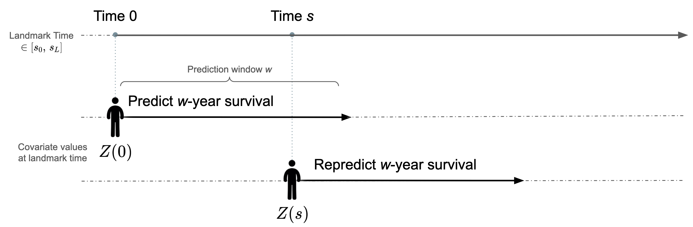

# A short introduction to the theory behind the landmark supermodel

## 1. Overview

The landmark model for survival data is built on the concept of risk assessment times (i.e., landmarks) that span risk prediction times of interest, using the information on the individuals who survived up to that given time point. In this approach, the dataset of the study cohort is transformed into multiple censored datasets based on a prediction window of interest and the predefined landmark times. A model is fit on the stacked super dataset (i.e., supermodel), and dynamic w-year risk prediction is then performed by using the most up-to-date value of a patient's covariate values. Specifically, risk prediction for the next w years is made at baseline (e.g., diagnosis) as well as at a later set of risk assessment times (“landmark prediction times”) after baseline (e.g., at 1, 2, and 3 years after diagnosis), where w is a fixed prediction window.

## 2. Landmarking

Landmarking for risk prediction on survival data is a method for w-year dynamic risk prediction where an individual has a personalized risk prediction which is updated as new information is collected among those who survived at a given time for risk assessment. Traditionally, a separate Cox proportional hazards (PH) model is applied to each landmark dataset [1]. Predictions can then be made at each landmark time point. The landmark supermodel combines these models by introducing smoothing to permit risk prediction at any landmark [2].

Landmarking was first introduced as a concept by Anderson et al. (1983) [3], was adapted to dynamic prediction for survival by van Houwelingen (2007) [4], and then used in the context of time-dependent covariates by van Houwelingen and Putter (2008) [5]. It was then conceptualized for competing risks by Nicolaie and van Houwelingen (2012) [2]. The following framework is explained in further detail in van Houwelingen (2007) [4] and Nicolaie and van Houwelingen (2012) [2].

## 3. Sliding Landmark Model and Extension to Competing Risks

Let $w$ be the prediction window of interest. We aim to create a model to estimate $w$-year risk at a landmark time $s$, knowing an individual’s covariates at $s$, $Z(s)$, and conditional on being alive at $s$. To create the landmark model, risk prediction times of interest are first partitioned into different landmarks ${s_0,…,s_L}$. The *sliding landmark dataset* is created for each landmark s, using only the data of individuals at risk (i.e., not censored or having experienced an event) with administrative censoring applied after $s+w$. For a time-dependent covariate, the dataset contains the most recent covariate value of the patient $Z(s)$, which is considered as a fixed variable. 

Suppose that individuals can experience one of $C$ types of failure ('causes'). Competing risk analysis accounts for the probability of other causes of failure, by estimating the probability of a specific event while considering the presence of competing events. Each event (‘cause’) is modelled through a cause-specific hazard.

To create the sliding landmark model, a separate cox model is fit to each dataset by maximizing the Cox partial likelihood to find the parameters $\beta(s)$ - leading to a conditional hazard of the following form: 

For a time $t$ such that $s \leq t \leq s+w$:
- Standard survival analysis:
$$h(t \mid Z(s), s) = h_0(t \mid s) \exp(Z(s) \beta(s))$$
- Under competing risks for cause $j \in C$:
$$h_j(t \mid Z(s), s) = h_{j0}(t \mid s) \exp(Z(s) \beta_j(s))$$

In summary, the sliding landmark model consists of different models for each landmark, and predictions can only be made at these predefined landmarks. 

## 4. The Landmark Supermodel

At a high-level, the landmark supermodel introduces smoothing between the separate sliding landmark models, to create one model that provides w-year prediction at any $s\in[s_0,s_L]$.

A super dataset is built to create the landmark supermodel: 
1. Fix $w$, a prediction horizon/window, and partition risk prediction times of interest into different landmarks ${s_0,…,s_L}$.
2. Build a landmark data set for each $s_i$ as before - i.e., with left truncation at $s_i$, right administrative censoring after $s_i+w$, and using the covariate values $Z(s_i)$.
3. Stack these data sets to create a “super prediction data set.”

A Cox (or cause-specific Cox) model is trained on the super dataset. To account for covariate landmark-varying effects, the regression coefficients depend smoothly on $t_{LM}=s$ (modelled linearly), i.e., $\beta(s) = \sum_k \beta_k f_k(s)$ for some functions $f_k (s)$. The default in our implementation is: 
$$\beta(s)= \beta_0+ \beta_1 s+ \beta_2 s^2$$

Note that the regression parameters depend on prediction time, not the event time! The baseline hazard also depends on the prediction time $s$, and this can be modelled by: $h_0 (t│s)=h_0 (t)\exp(\alpha(s))$. The default in our implementation is 
$$\alpha(s)= \alpha_0+\alpha_1 s$$

Such a model is then fit on the super dataset, which leads to the hazard: 
$$h_j(t \mid Z(s), s) = h_{j0}(t) \exp(\alpha_j(s) + \beta_j(s) Z(s))$$

In summary, the main effects for the landmark time $s$ is modeled by $\alpha(s)$ and the interaction of $s$ with the covariates is modeled by $\beta(s)$. The baseline hazard at time t when predicting from landmark $s$, $h_0 (t│s)=h_0 (t)\exp(\alpha(s))$, is the probability that a person with all zero covariates will experience the event in the instant $t$ if that person survived from $s$. Dependence between entries needs to be accounted for, for example, by using a robust sandwich estimator, as the same patient appears multiple times in the super dataset. 

## 5. Prediction

Prediction uses the most up-to-date patient covariates. The cumulative hazard is defined as $H(s+w \mid Z(s), s) = \int_s^{s+w} h(t \mid Z(s), s) \, dt$. Under the Cox model (time-to-event data), survival $S$ and cumulative incidence $F$ are as follows:

$$S(s+w \mid Z(s), s) = \exp\left(-\int_s^{s+w} h(t \mid Z(s), s) \, dt \right)$$
$$F(s+w \mid Z(s), s) = 1 - S(s+w \mid Z(s), s)$$

Under competing risks, all cause-specific hazards are considered, with coefficients from each of the cause-specific Cox models, $\beta_j (s)= \beta_{j0}+ \beta_{j1} s+ \beta_{j2} s^2$ and $\alpha_j (s)= \alpha_{j0}+\alpha_{j1} s$. To compute survival, the cumulative cause-specific hazards are summed:

$$S(s+w \mid Z(s), s) = \exp\left(\int_s^{s+w} \sum_{j=1}^C h_j(t \mid Z(s), s) dt \right) $$

Cause-specific cumulative incidence considers the chance of failure from cause $j$ in each interval conditional on surviving to that point:

$$F_j(s+w \mid Z(s), s) = \int_s^{s+w} h_j(t \mid Z(s), s) \ S(t \mid Z(s), s)dt$$

Note that for the sliding landmark model, $h_j (t│Z(s),s)=h_{j0} (t│s)  \exp⁡(Z(s) \beta_j (s))$  and for the supermodel, $h_j (t│Z(s),s)=h_{j0} (t)  \exp⁡(\alpha_j (s)+ \beta_j (s)Z(s))$.

## 6. Penalization (penLM)

With a large dataset and time-dependent effects, the supermodel has many parameters. We introduce penalization to ensure better generalization while handling much higher dimensionality. A model is fit by maximizing the penalized pseudo-partial likelihood (PPL) of the supermodel.

For a single-cause model the unpenalized PPL is given by:
$$ipl^*(\beta,\alpha) := \prod_{i=1}^n \prod_{s:s\le T_i\le s+w} \left( \frac{\exp(Z_i(s)^T \beta(s) + \alpha(s))}{\sum_{s: s \leq T_i \leq s+w} \sum_{j \in R(T_i)} \exp(Z_j(s)^T \beta(s) + \alpha(s))} \right)^{\eta_i}$$

Where $R(T)$ is the risk set of patients alive at $T$ and $\eta_i, T_i$  are respectively if the event occurred and time-to-event for patient i. When multiple causes/competing risks are present, the PPL factors over the J competing events, assuming an independent censoring mechanism.9 This allows for the PPL to be maximized by maximizing individual cause-specific Cox models. The PPL for J competing events is given by:
$$ipl^*(B,A) = \prod_{j=1}^J ipl^*(\beta_j,\alpha_j)$$
where $B = (\beta_1,...,\beta_j)$ and $A = (\alpha_1,...,\alpha_j)$ are the cause-specific coefficients.

The penalized log PPL for a single-cause model is given by the following equation where the penalty $p(\cdot)$ can be a LASSO (the L1 norm) [6], Ridge (the L2 norm) [7], or an elastic net (a combination of the two) [8].
$$\textrm{log}ipl^* (\beta,\alpha) - \lambda p(\beta,\alpha)$$

For competing events, as the PPL factors over the J competing events assuming an independent censoring mechanism, the penalized log PPL factors, too:
$$\sum_{j=1}^J \left\{ \textrm{log}ipl^* (\beta_j,\alpha_j) - \lambda_j p(\beta_j,\alpha_j) \right\}$$

Where $\lambda_j$ is a cause-specific penalty. Penalization is thus essentially performed on each cause-specific Cox model separately, in line with the unpenalized method. 

Penalization leads to a trade-off between the model complexity and goodness-of-fit, where the optimal weights $\lambda_j$ are chosen via the cross-validated penalized log PPLs [10]. The methods used for prediction remain the same using the values for $\beta_j, \alpha_j$ obtained. 

## 7. References

1. van Houwelingen, H. and H. Putter, Dynamic prediction in clinical survival analysis. 2011: CRC Press.
2.	Nicolaie, M.A., et al., Dynamic prediction by landmarking in competing risks. Stat Med, 2013. 32(12): p. 2031-47.
3.	Anderson, J.R., K.C. Cain, and R.D. Gelber, Analysis of survival by tumor response. J Clin Oncol, 1983. 1(11): p. 710-9.
4.	Van Houwelingen, H.C., Dynamic prediction by landmarking in event history analysis. Scandinavian Journal of Statistics, 2007. 34(1): p. 70-85.
5.	van Houwelingen, H.C. and H. Putter, Dynamic predicting by landmarking as an alternative for multi-state modeling: an application to acute lymphoid leukemia data. Lifetime Data Anal, 2008. 14(4): p. 447-63.
6.	Tibshirani, R., Regression Shrinkage and Selection Via the Lasso. Journal of the Royal Statistical Society: Series B (Methodological), 2018. 58(1): p. 267-288.
7.	Hoerl, A.E. and R.W. Kennard, Ridge Regression: Biased Estimation for Nonorthogonal Problems. Technometrics, 2000. 42(1): p. 80-86.
8.	Zou, H. and T. Hastie, Regularization and Variable Selection Via the Elastic Net. Journal of the Royal Statistical Society Series B: Statistical Methodology, 2005. 67(2): p. 301-320.
9.	Prentice, R.L., et al., The Analysis of Failure Times in the Presence of Competing Risks. Biometrics, 1978. 34(4): p. 541-554.
10.	Verweij, P.J. and H.C. Van Houwelingen, Cross-validation in survival analysis. Stat Med, 1993. 12(24): p. 2305-14.
