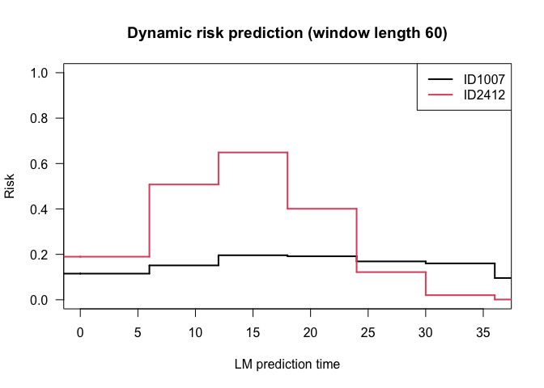

<!-- README.md is generated from README.Rmd. Please edit that file -->
<!-- badges: start -->
<!-- badges: end -->

# Basic Example 2

This is a basic example which shows you how to use `dynamicLM` to make
dynamic 5-year predictions and check calibration and discrimination
metrics.

## Installation

In order to use `dynamicLM`, you need the development version of
`riskRegression`. Both are available from [GitHub](https://github.com/)
with:

``` r
# install.packages("devtools")
devtools::install_github("tagteam/riskRegression")
devtools::install_github("thehanlab/dynamicLM")
```

Package documentation can be found in [this
pdf](https://github.com/thehanlab/dynamicLM/blob/main/tutorials/dynamicLM_1.0.0.pdf)
and more information about any function can be obtained by running
`?function_name`.

## Data

We illustrate the package using the long-form example data set given in
the package. This gives the time-to-event of cancer relapse under two
competing risks. Three fixed patient bio-markers are given as well (age
at baseline, stage of initial cancer, bmi, male). A time-dependent
covariate treatment indicates if the treatment is on or off treatment
and `T_txgiven` gives the time at which this patient entry was created.

``` r
library(dynamicLM)
#> Loading required package: prodlim
#> Loading required package: riskRegression
#> riskRegression version 2024.12.06
#> Loading required package: survival
```

``` r
data(relapse)
dim(relapse)
#> [1] 989   9
```

``` r
length(unique(relapse$ID)) # There are 171 patients with two entries, i.e., one after time 0
#> [1] 818
```

## Build a super data set

We first note the outcome variables we are interested in, as well as
which variables are fixed or landmark-varying. When there are no
landmark-varying variables, set `varying = NULL`.

``` r
outcome <- list(time = "Time", status = "event")
covars <- list(fixed = c("age.at.time.0","male","stage","bmi"),
               varying = c("treatment"))
```

We will produce 5-year dynamic predictions of relapse (`w`). Landmark
time points (`lms`) are set as every year between 0 and 3 years to train
the model. This means we are only interested in prediction between 0 and
3 years.

We will consider linear and quadratic landmark interactions with the
covariates (given by `func_covars = c("linear", "quadratic")`) and the
landmarks (`func_lms = c("linear", "quadratic")`). The covariates that
should have these landmark interactions are given in `pred_covars`.

``` r
w <- 60                    # risk prediction window (risk within time w)
lms <- seq(0,36,by=6)      # landmarks on which to build the model

# Choose variables that will have time interaction
pred_covars <- c("age", "male", "stage", "bmi", "treatment") 
```

With this, we are ready to build the super data set that will train the
model. We print intermediate steps for illustration.

There are three steps:

1.  `stack_data()`: stacks the landmark data sets
2.  An **optional** additional update for more complex columns that vary
    with landmark-times: For example, here we update the value of age.
3.  `add_interactions()`: Landmark time interactions are added, note the
    additional columns created.

*Note that these return an object of class `LMdataframe`. This has a
component `data` which contains the dataset itself.*

We illustrate the process in detail by printing the entries at each step
for one individual, ID1029.

``` r
relapse[relapse$ID == "ID1029", ]  
#>       ID     Time event age.at.time.0 male stage  bmi treatment T_txgiven
#> 7 ID1029 60.03288     0      62.25753    0     0 26.8         0      0.00
#> 8 ID1029 60.03288     0      62.25753    0     0 26.8         1     12.96
```

We first stack the datasets over the landmarks (see the new column ‘LM’)
and update the treatment covariate. Note that one row is created for
each landmark that the individual is still alive at. In this row, if
time is greater time than the landmark time plus the window, it is
censored at this value (this occurs in the first row, for example,
censored at 0+60), and the most recent value all covariates is used (in
our case, only treatment varies).

``` r
# Stack landmark datasets
lmdata <- stack_data(relapse, outcome, lms, w, covars, format = "long",
                     id = "ID", rtime = "T_txgiven")
data <- lmdata$data
print(data[data$ID == "ID1029", ])
#>         ID     Time event LM age.at.time.0 male stage  bmi treatment T_txgiven
#> 7   ID1029 60.00000     0  0      62.25753    0     0 26.8         0      0.00
#> 73  ID1029 60.03288     0  6      62.25753    0     0 26.8         0      0.00
#> 751 ID1029 60.03288     0 12      62.25753    0     0 26.8         0      0.00
#> 8   ID1029 60.03288     0 18      62.25753    0     0 26.8         1     12.96
#> 851 ID1029 60.03288     0 24      62.25753    0     0 26.8         1     12.96
#> 855 ID1029 60.03288     0 30      62.25753    0     0 26.8         1     12.96
#> 875 ID1029 60.03288     0 36      62.25753    0     0 26.8         1     12.96
```

We then (optionally) update more complex LM-varying covariates. Here we
create an age covariate, based on age at time 0.

``` r
lmdata$data$age <- lmdata$data$age.at.time.0 + lmdata$data$LM/12 # age is in years and LM is in months
data <- lmdata$data
print(data[data$ID == "ID1029", ])
#>         ID     Time event LM age.at.time.0 male stage  bmi treatment T_txgiven
#> 7   ID1029 60.00000     0  0      62.25753    0     0 26.8         0      0.00
#> 73  ID1029 60.03288     0  6      62.25753    0     0 26.8         0      0.00
#> 751 ID1029 60.03288     0 12      62.25753    0     0 26.8         0      0.00
#> 8   ID1029 60.03288     0 18      62.25753    0     0 26.8         1     12.96
#> 851 ID1029 60.03288     0 24      62.25753    0     0 26.8         1     12.96
#> 855 ID1029 60.03288     0 30      62.25753    0     0 26.8         1     12.96
#> 875 ID1029 60.03288     0 36      62.25753    0     0 26.8         1     12.96
#>          age
#> 7   62.25753
#> 73  62.75753
#> 751 63.25753
#> 8   63.75753
#> 851 64.25753
#> 855 64.75753
#> 875 65.25753
```

Lastly, we add landmark time-interactions. We use the following naming
convention: `_LM1` refers to the first interaction in `func_covars`,
`_LM2` refers to the second interaction in `func_covars`, etc. For
example, with linear and quadratic terms, `stage_LM1` refers to
`stage * LM`, `stage_LM2` is `stage * LM^2`. Similarly, `LM1` and `LM2`
are created from `func_lm`. Here, `LM1` = `LM` and `LM2` = `LM^2`. Note
that we use `pred_covars` here, defined earlier as the covariates that
will have landmark time interactions.

``` r
lmdata <- add_interactions(lmdata, pred_covars, func_covars = c("linear", "quadratic"), 
                           func_lms = c("linear", "quadratic")) 
data <- lmdata$data
print(data[data$ID == "ID1029", ])
#>         ID     Time event LM age.at.time.0 male stage  bmi treatment T_txgiven
#> 7   ID1029 60.00000     0  0      62.25753    0     0 26.8         0      0.00
#> 73  ID1029 60.03288     0  6      62.25753    0     0 26.8         0      0.00
#> 751 ID1029 60.03288     0 12      62.25753    0     0 26.8         0      0.00
#> 8   ID1029 60.03288     0 18      62.25753    0     0 26.8         1     12.96
#> 851 ID1029 60.03288     0 24      62.25753    0     0 26.8         1     12.96
#> 855 ID1029 60.03288     0 30      62.25753    0     0 26.8         1     12.96
#> 875 ID1029 60.03288     0 36      62.25753    0     0 26.8         1     12.96
#>          age   age_LM1   age_LM2 male_LM1 male_LM2 stage_LM1 stage_LM2 bmi_LM1
#> 7   62.25753    0.0000     0.000        0        0         0         0     0.0
#> 73  62.75753  376.5452  2259.271        0        0         0         0   160.8
#> 751 63.25753  759.0904  9109.085        0        0         0         0   321.6
#> 8   63.75753 1147.6356 20657.441        0        0         0         0   482.4
#> 851 64.25753 1542.1808 37012.340        0        0         0         0   643.2
#> 855 64.75753 1942.7260 58281.781        0        0         0         0   804.0
#> 875 65.25753 2349.2712 84573.764        0        0         0         0   964.8
#>     bmi_LM2 treatment_LM1 treatment_LM2 LM1  LM2
#> 7       0.0             0             0   0    0
#> 73    964.8             0             0   6   36
#> 751  3859.2             0             0  12  144
#> 8    8683.2            18           324  18  324
#> 851 15436.8            24           576  24  576
#> 855 24120.0            30           900  30  900
#> 875 34732.8            36          1296  36 1296
```

One can print `lmdata`. The argument `verbose` allows for additional
stored objects to be printed (default is FALSE).

``` r
print(lmdata, verbose = TRUE)
```

## Fit the super model

Now we can fit the model. We fit a model with all the covariates
created. Note that `lmdata$all_covs` returns a vector with all the
covariates that have LM interactions and from `pred_covars`. Again, the
`_1` refers to the first interaction in `func_covars`, `_2` refers to
the second interaction in `func.covars`, etc… `LM_1` and `LM_2` are
created from `func_lms`.

``` r
all_covs <- lmdata$all_covs
print(all_covs)
#>  [1] "age"           "male"          "stage"         "bmi"          
#>  [5] "treatment"     "age_LM1"       "age_LM2"       "male_LM1"     
#>  [9] "male_LM2"      "stage_LM1"     "stage_LM2"     "bmi_LM1"      
#> [13] "bmi_LM2"       "treatment_LM1" "treatment_LM2" "LM1"          
#> [17] "LM2"
```

It is then easy to fit a landmark supermodel using `dynamic_lm()`. A
formula, super dataset and method need to be provided. If the super
dataset is not of class `LMdataframe` (i.e., is a self-created R
dataframe), then additional parameters must be specified. In this case,
see the details section of the documentation of `add_interactions()` for
information on how the landmark interaction terms must be named.

``` r
formula <- "Hist(Time, event, LM) ~ 
            age + age_LM1 + age_LM2 +
            male + male_LM1 + male_LM2 +
            stage + stage_LM1 + stage_LM2 +
            bmi + bmi_LM1 + bmi_LM2 + 
            treatment + treatment_LM1 + treatment_LM2 + 
            LM1 + LM2 + cluster(ID)"
supermodel <- dynamic_lm(lmdata, as.formula(formula), "CSC", x = TRUE) 
#> Warning in agreg.fit(X, Y, istrat, offset, init, control, weights = weights, :
#> Loglik converged before variable 5,6 ; beta may be infinite.
print(supermodel)
#> 
#> Landmark cause-specific cox super model fit for dynamic prediction of window size 60:
#> 
#> $model
#> ----------> Cause: 1
#>                     coef  exp(coef)   se(coef)  robust se       z        p
#> age            2.896e-02  1.029e+00  3.093e-02  3.433e-02   0.844  0.39893
#> age_LM1        4.573e-04  1.000e+00  4.384e-03  2.606e-03   0.175  0.86071
#> age_LM2       -8.016e-05  9.999e-01  1.238e-04  7.297e-05  -1.098  0.27201
#> male           1.632e+00  5.112e+00  5.271e-01  5.254e-01   3.105  0.00190
#> male_LM1       1.453e-01  1.156e+00  1.083e-01  2.397e-02   6.064 1.33e-09
#> male_LM2      -8.921e-03  9.911e-01  4.959e-03  8.159e-04 -10.934  < 2e-16
#> stage          8.954e-01  2.448e+00  2.685e-01  2.881e-01   3.108  0.00189
#> stage_LM1      1.067e-02  1.011e+00  3.860e-02  2.052e-02   0.520  0.60302
#> stage_LM2     -1.056e-03  9.989e-01  1.121e-03  5.840e-04  -1.807  0.07069
#> bmi            2.262e-03  1.002e+00  2.403e-02  2.511e-02   0.090  0.92821
#> bmi_LM1        1.340e-03  1.001e+00  3.385e-03  1.535e-03   0.873  0.38258
#> bmi_LM2       -6.102e-05  9.999e-01  9.713e-05  3.813e-05  -1.600  0.10950
#> treatment     -1.472e+00  2.295e-01  1.287e+00  1.345e+00  -1.094  0.27384
#> treatment_LM1  1.503e-01  1.162e+00  1.150e-01  9.866e-02   1.524  0.12760
#> treatment_LM2 -2.950e-03  9.971e-01  2.456e-03  1.885e-03  -1.565  0.11759
#> LM1           -7.468e-02  9.280e-01  2.784e-01  1.708e-01  -0.437  0.66195
#> LM2            6.981e-03  1.007e+00  7.837e-03  4.848e-03   1.440  0.14991
#> 
#> Likelihood ratio test=NA  on 17 df, p=NA
#> n= 2787, number of events= 251 
#> 
#> 
#> ----------> Cause: 2
#>                     coef  exp(coef)   se(coef)  robust se      z        p
#> age            3.047e-02  1.031e+00  9.707e-03  1.053e-02  2.894 0.003799
#> age_LM1        1.776e-03  1.002e+00  2.051e-03  1.884e-03  0.942 0.345945
#> age_LM2       -3.555e-05  1.000e+00  6.811e-05  5.581e-05 -0.637 0.524153
#> male          -7.321e-03  9.927e-01  2.926e-01  3.284e-01 -0.022 0.982215
#> male_LM1       7.982e-01  2.222e+00  4.063e+01  2.136e-01  3.736 0.000187
#> male_LM2      -1.592e-01  8.528e-01  6.771e+00  1.779e-02 -8.949  < 2e-16
#> stage         -1.346e-01  8.741e-01  9.742e-02  9.975e-02 -1.349 0.177310
#> stage_LM1      1.550e-02  1.016e+00  2.038e-02  1.755e-02  0.883 0.377385
#> stage_LM2     -9.016e-04  9.991e-01  6.987e-04  6.136e-04 -1.469 0.141745
#> bmi           -4.412e-03  9.956e-01  8.547e-03  9.176e-03 -0.481 0.630639
#> bmi_LM1       -1.082e-03  9.989e-01  1.725e-03  1.308e-03 -0.827 0.408164
#> bmi_LM2       -1.624e-06  1.000e+00  5.694e-05  3.950e-05 -0.041 0.967194
#> treatment      6.513e-01  1.918e+00  4.589e-01  4.592e-01  1.418 0.156087
#> treatment_LM1 -5.332e-02  9.481e-01  4.928e-02  4.293e-02 -1.242 0.214307
#> treatment_LM2  1.182e-03  1.001e+00  1.174e-03  9.039e-04  1.307 0.191124
#> LM1           -8.247e-02  9.208e-01  1.342e-01  1.175e-01 -0.702 0.482726
#> LM2            2.226e-03  1.002e+00  4.466e-03  3.534e-03  0.630 0.528756
#> 
#> Likelihood ratio test=NA  on 17 df, p=NA
#> n= 2787, number of events= 1120
```

There are additional ways of printing/accessing the model:

``` r
# E.g., of additional arguments to print
# * cause: only print this cause-specific model
# * verbose: show additional stored objects
print(supermodel, cause = 1, verbose = TRUE)

# Coefficients can easily be accessed via
coef(supermodel)
```

Dynamic hazard ratios can be plotted, either log hazard ratio or hazard
ratio using the argument `logHR`. Specifying the `covars` arguments
allows for a subset of dynamic hazard ratios to be plotted.

``` r
par(mfrow = c(2,3))
plot(supermodel)
```


``` r
# To create only two plots:
plot(supermodel, covars = c("age", "male"))
```

## Obtain predictions

### For the training data

Predictions for the training data can easily be obtained. This provides
*w*-year risk estimates for each individual at each of the training
landmarks they are still alive.

``` r
p1 <- predict(supermodel)
print(p1)
#> $preds
#>   LM       risk
#> 1  0 0.11514265
#> 2  0 0.04641678
#> 3  0 0.04639277
#> 4  0 0.11005431
#> 5  0 0.04485027
#> 6  0 0.04585672
#>  [ omitted 2782 rows ]
```

One can print the predictions. The argument `verbose` allows for
additional stored objects to be printed (default is FALSE).

``` r
print(p1, verbose = TRUE)
```

### For new data

A prediction is made for an individual at a specific prediction time.
Thus both a prediction (“landmark”) time (e.g., at baseline, at 2 years,
etc) and an individual (i.e., covariate values set at the landmark
time-point) must be given. Note that the model creates the landmark
time-interactions; the new data has the same form as in your original
dataset. For example, we can prediction *w*-year risk from baseline
using an entry from the very original data frame.

``` r
# Individuals with covariate values at 0
individuals <- relapse[1:2, ]
individuals$age <- individuals$age.at.time.0
individuals$LM <- 0 # Prediction time
print(individuals)
#>       ID       Time event age.at.time.0 male stage  bmi treatment T_txgiven
#> 1 ID1007 62.6849315     0      60.25936    0     1 25.9         0         0
#> 2  ID101  0.6575342     1      59.97808    0     0 29.3         0         0
#>        age LM
#> 1 60.25936  0
#> 2 59.97808  0
```

``` r
p0 <- predict(supermodel, individuals, lms = "LM", cause = 1)
p0$preds
#>   LM       risk
#> 1  0 0.11514265
#> 2  0 0.04641678
```

## Model evaluation/validation

Calibration plots, which assess the agreement between predictions and
observations in different percentiles of the predicted values, can be
plotted for each of the landmarks used for prediction. Entering a named
list of prediction objects in the first argument allows for comparison
between models. This list can be of supermodels or prediction objects
(created by calling `predict()`).

``` r
par(mfrow = c(2, 3), pty = "s")
outlist <- calplot(list("LM supermodel" = p1), 
                    times = c(0,6,12,18,24,30), # landmarks to plot at
                    method = "quantile", q=10,  # method for calibration plot
                    # Optional plotting parameters to alter
                    ylim = c(0, 0.36), xlim = c(0, 0.36), 
                    lwd = 1, legend = F, 
                    xlab = "Predicted Risk", ylab = "Observed Risk")
```


Predictive performance can also be assessed using time-dependent dynamic
area under the receiving operator curve (AUCt) or time-dependent dynamic
Brier score (BSt).

- AUCt is defined as the percentage of correctly ordered markers when
  comparing a case and a control – i.e., those who incur the pr imary
  event within the window w after prediction and those who do not.
- BSt provides the average squared difference between the primary event
  markers at time w after prediction and the absolute risk estimates by
  that time point.

``` r
scores <- score(list("LM supermodel" = p1),
                     times = c(6, 12, 18, 24)) # landmarks at which to assess
```

These results can also be print or plot with point wise confidence
intervals. Setting `se = FALSE` in plot excludes the intervals.

``` r
print(scores)
```

``` r
par(mfrow = c(1, 4))
plot(scores)
```


**Bootstrapping** can be performed by calling `calplot()` or `score()`
and setting the arguments `split.method = "bootcv"` and `B = 10` (or
however many bootstrap replications are desired). Note that the argument
`x = TRUE` must be specified when fitting the model (i.e., when calling
`dynamic_lm()`).

``` r
# Remember to fit the supermodel with argument 'x = TRUE'
scores <- score(list("LM supermodel" = supermodel),
              times = c(0, 6, 12, 18),
              split.method = "bootcv", B = 10)        # 10 bootstraps

par(mfrow = c(1, 2))
outlist <- calplot(list("LM supermodel" = supermodel), 
                    times = c(0, 6, 12, 18),          # landmarks to plot at
                    method = "quantile", q = 5,       # calibration plot method
                    split.method = "bootcv", B = 10,  # 10 bootstraps
                    # Optional plotting parameters to alter
                    ylim = c(0, 0.36), xlim = c(0, 0.36), 
                    lwd = 1, xlab = "Predicted Risk", ylab = "Observed Risk", 
                    legend = FALSE)
```

**External validation** can be performed by specifying the supermodel as
the object argument and passing new data through the `data` argument.
This data can be a LMdataframe or a dataframe (in which case `lms` must
be specified). Alternatively, predictions can be made on new data using
`predict()` and this object can be input.

``` r
# Use all data from baseline as "new" data
newdata <- relapse[relapse$T_txgiven == 0, ]
newdata$age <- newdata$age.at.time.0
newdata$LM <- 0 # specify the landmark time of the data points

par(mfrow = c(1,1))
cal <- calplot(list("CSC" = supermodel), cause = 1, data = newdata, lms = "LM",
               method = "quantile", q = 10, ylim = c(0, 0.1), xlim = c(0, 0.1))

score(list("CSC" = supermodel), cause = 1, data = newdata, lms = "LM")
```

### Visualize individual dynamic risk trajectories

Individual risk score trajectories can be plotted. As with `predict()`,
the data input is in the form of the original data. For example, we can
consider two individuals of similar age, bmi, and treatment status at
baseline, but of different gender.

``` r
idx <- relapse$ID %in% c("ID2412", "ID1007")
relapse[idx, ]
#>         ID     Time event age.at.time.0 male stage  bmi treatment T_txgiven
#> 1   ID1007 62.68493     0      60.25936    0     1 25.9         0      0.00
#> 442 ID2412 43.35342     0      60.09132    1     0 24.1         0      0.00
#> 443 ID2412 43.35342     0      60.09132    1     0 24.1         1     39.04
```

We turn our data into long-form data to plot.

*Note: we convert to long-form because of the age variable, wide-form
data can be used too if there are no complex variables involved.*

``` r
# Prediction time points 
x <- seq(0, 36, by = 6)

# Stack landmark datasets
dat <- stack_data(relapse[idx, ], outcome, x, w, covars, format = "long", 
                  id = "ID", rtime = "T_txgiven")$data
dat$age <- dat$age.at.time.0 + dat$LM / 12 # age is in years and LM is in months

head(dat)
#>          ID     Time event LM age.at.time.0 male stage  bmi treatment T_txgiven
#> 1    ID1007 60.00000     0  0      60.25936    0     1 25.9         0         0
#> 442  ID2412 43.35342     0  0      60.09132    1     0 24.1         0         0
#> 11   ID1007 62.68493     0  6      60.25936    0     1 25.9         0         0
#> 4421 ID2412 43.35342     0  6      60.09132    1     0 24.1         0         0
#> 12   ID1007 62.68493     0 12      60.25936    0     1 25.9         0         0
#> 4422 ID2412 43.35342     0 12      60.09132    1     0 24.1         0         0
#>           age
#> 1    60.25936
#> 442  60.09132
#> 11   60.75936
#> 4421 60.59132
#> 12   61.25936
#> 4422 61.09132
```

``` r
plotrisk(supermodel, dat, format = "long", x.legend = "topright")
```



We can see that the male has a higher and increasing 5-year risk of
recurrence that peaks around 1 year, and then rapidly decreases. This
can be explained by the dynamic hazard rate of being male (seen above).
In comparison, the 5-year risk of recurrent for the female remains
relatively constant.
